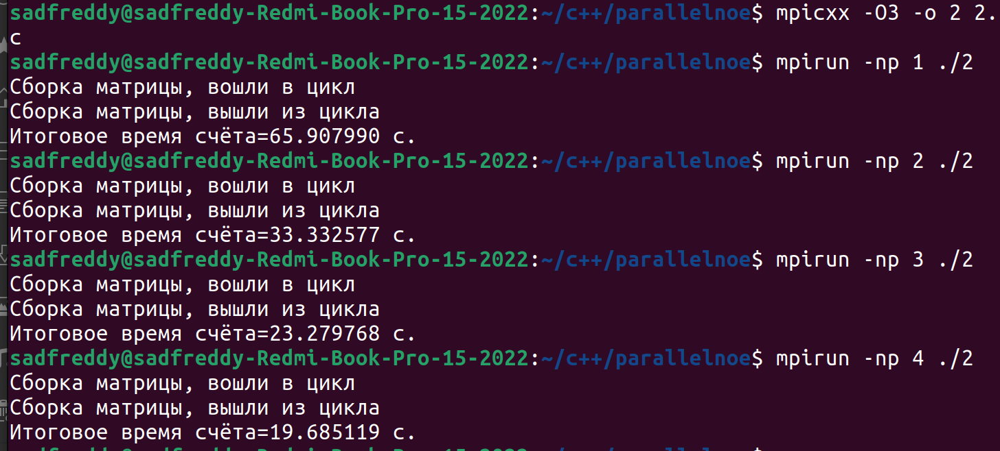

# Постановка задач: 
## В 1 программе з последнего процесса отправить сообщение с его номером в главный(нулевой) процесс. Прочитать сообщение в главном процессе и вывести его на экран; 
## Во 2 программе посчитать разность следующих интегралов методом трапеции: $\int_{1}^{9}3\sqrt{x}dx - \int_{0}^{1}cos(x)dx$; 
## В 3 программе написать параллельную программу, вычисляющую матричное выражение: $F=A^2+B^2$
## Результаты работы 1 прграммы: 
## Результаты работы 2 прграммы: 
## Результаты работы 3 прграммы: 
